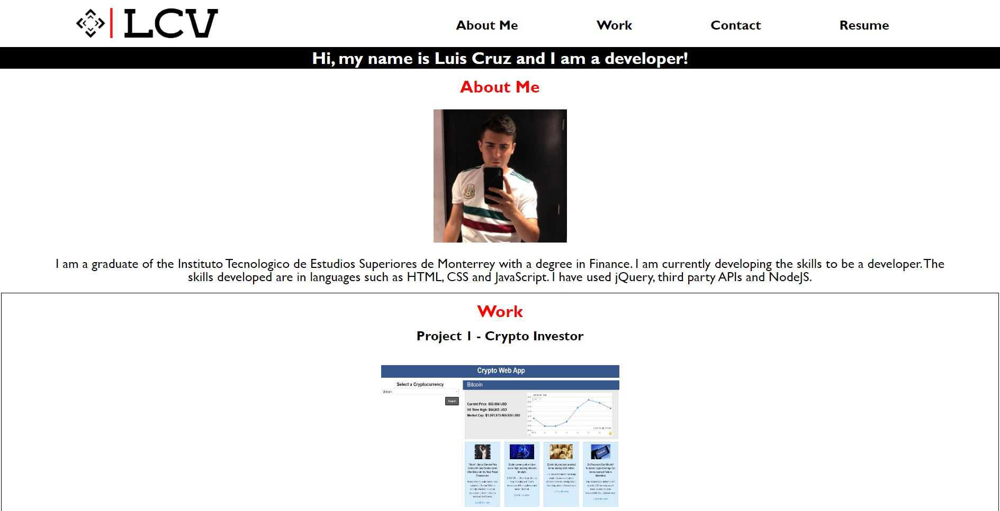
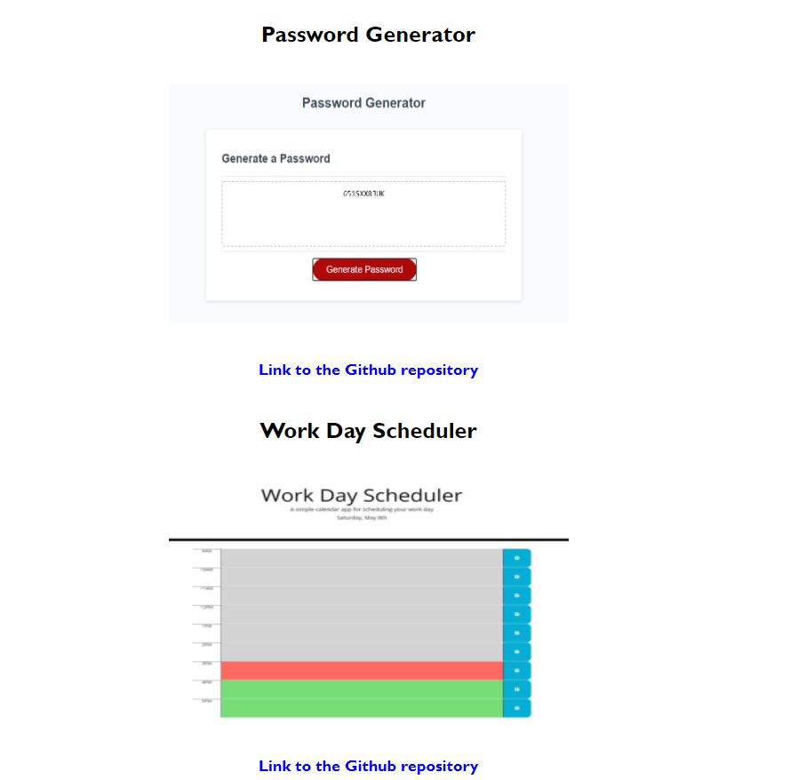

# Portfolio

## Description

This project consists of my page for my personal portfolio. At the top there is a navigation bar to be able to scroll through the different sections. There is a brief presentation about me and a section for the main projects developed.

In the work section you can find a main project and two subjects.

The project consists of a web page that allows you to check the price of four cryptocurrencies along with relevant news about them. The subjects are a generator of passwords depending on criteria to choose from and a scheduler for a working day.

As a footer there is a section to contact me, as well as links to my GitHub and LinkedIn profile.

## Technologies used:

* HTML5
* CSS

## Mock Up

Portfolio: <https://luiscruz-24.github.io/Portfolio_Luis/>

### Personal Portfolio - Luis Cruz

## Contact

Email: luis.crz.v@gmail.com