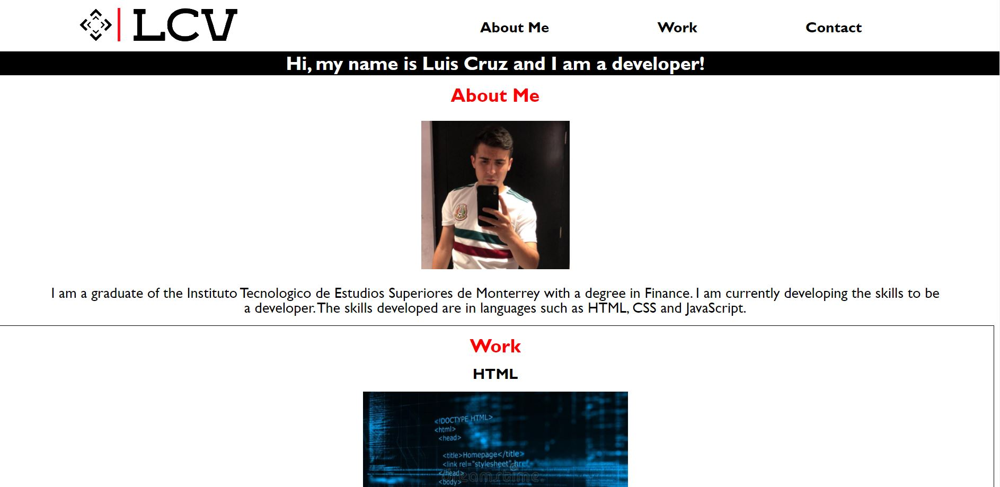

# Portfolio

## Description

This project consists of creating a home page for my personal portfolio. In the HTML code, links were used to connect the titles of the navigation bar with the content information. 
In the development of the code, a semantic criterion was used to be able to identify the parts of the page more easily. In addition, helpful comments were added for the following modifications.

At the moment I do not have developed projects but the links of each section (HTML, CSS and JavaScript) would be updated as I develop them.

## Acceptance Criteria

```
GIVEN I need to sample a potential employee's previous work
WHEN I load their portfolio
THEN I am presented with the developer's name, a recent photo, and links to sections about them, their work, and how to contact them
WHEN I click one of the links in the navigation
THEN the UI scrolls to the corresponding section
WHEN I click on the link to the section about their work
THEN the UI scrolls to a section with titled images of the developer's applications
WHEN I am presented with the developer's first application
THEN that application's image should be larger in size than the others
WHEN I click on the images of the applications
THEN I am taken to that deployed application
WHEN I resize the page or view the site on various screens and devices
THEN I am presented with a responsive layout that adapts to my viewport
```
## Mock Up

Portfolio: <https://luiscruz-24.github.io/Portfolio_Luis/>

### Personal Portfolio - Luis Cruz

